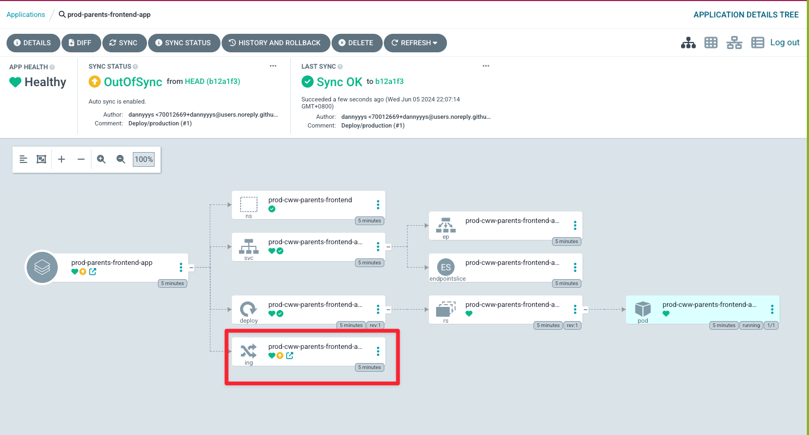
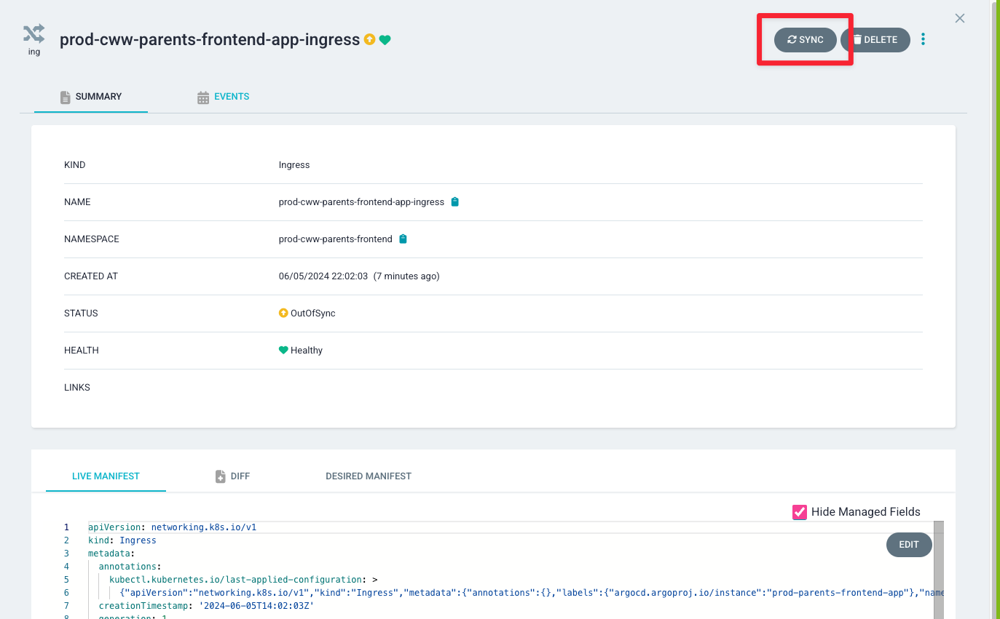
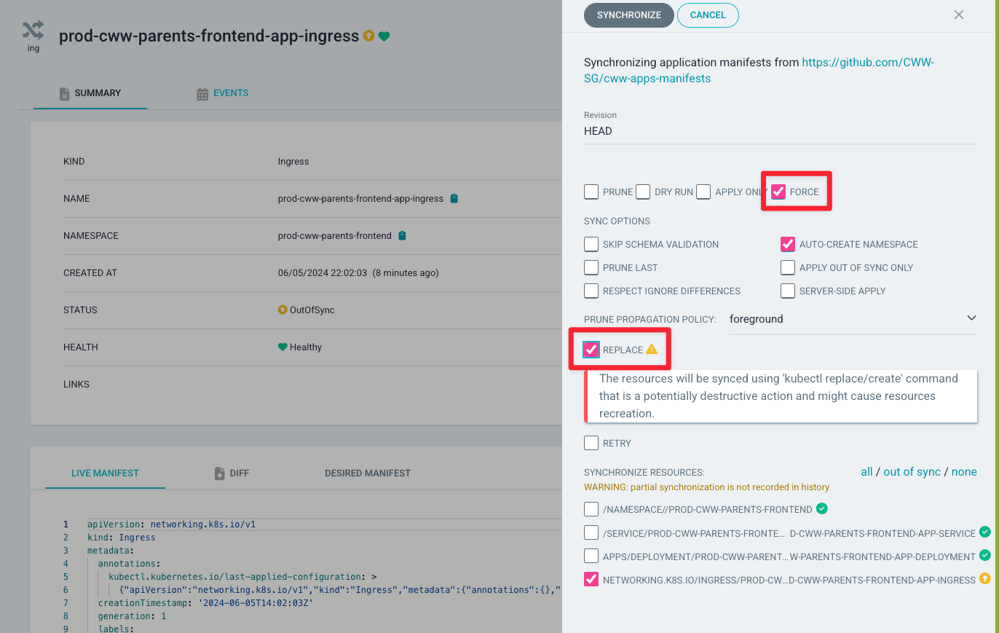

You will get `out-of-sync` error in ArgoCD when a new application is create for
an environment. This will disable https on the website. You can fix this by
syncing the errornous Ingress with `force` and `replace` selected. ArgoCD
simultaneously creating application resources caused this error.

